# eTicketing

eTicketing is an internal real-time support and eTicketing platform with a Node.js + Express + MySQL backend, a vanilla HTML/CSS/JavaScript frontend, and a C# WinForms (CefSharp) desktop client for staff.

It includes:
- JWT-based authentication (admin and user roles)
- Real-time messaging using Socket.io
- Ticket creation, assignment, status and priority tracking
- Admin dashboard and workspace workflow
- Desktop client packaging with C# WinForms (CefSharp) — supports older Windows (e.g., Windows 7)


## Project Structure

```text
Backend/      -> API server, Socket.io, auth/chat routes, frontend static files
Ticketing system Desktop App/ -> C# WinForms client (CefSharp) and runtime files
database/     -> MySQL schema + seed data (setup.sql)
*.txt         -> Deployment, maintenance, and dependency notes
```

## Tech Stack

Backend:
- Node.js
- Express
- Socket.io
- MySQL (`mysql2`)
- JWT (`jsonwebtoken`)
- `bcryptjs`
- `dotenv`
- `cors`

Desktop:
- C# WinForms (CefSharp, embedded Chromium)
- Visual Studio Community / .NET Framework 4.6.2
- CefSharp installed via NuGet (Visual Studio "Manage NuGet Packages")
- Compatibility note: Built targeting .NET Framework 4.6.2 to support legacy
  Windows versions (Windows 7); chosen for better compatibility on older OSes
  where Electron may not run reliably.

Frontend:
- Vanilla HTML/CSS/JavaScript
- Socket.io client via CDN

## Key Features

- Role-based access (`admin`, `user`)
- Secure login and registration with hashed passwords
- Protected API routes with JWT middleware
- Comprehensive Ticket Management (Create, Update, Filter, Assign)
- Real-time ticket messaging and event broadcasting
- Conversation and ticket history from MySQL
- Unread status updates via Socket.io
- Sender-only message deletion

## Architecture Overview

Runtime flow:
1. User or admin logs in via `/api/auth/login`.
2. Backend issues JWT token (24h expiry).
3. Frontend/Electron stores token and sends it in API calls.
4. Socket connects with token in handshake auth.
5. Messages are persisted in MySQL, then broadcast in real-time.

High-level components:
- Express REST API for auth and chat operations
- Socket.io layer for instant message delivery
- MySQL for users and messages
- CefSharp WinForms shell for desktop distribution (supports older Windows)

## API Summary

Auth:
- `POST /api/auth/register`
- `POST /api/auth/login`

Tickets:
- `GET /api/tickets` (Fetch all visible tickets)
- `POST /api/tickets` (Create a new ticket)
- `GET /api/tickets/:ticketId` (Get single ticket details)
- `PATCH /api/tickets/:ticketId` (Update status/priority/assignment)

Messages:
- `GET /api/chat/tickets/:ticketId/messages` (Load ticket chat history)
- `POST /api/chat/tickets/:ticketId/read` (Mark ticket as read)
- `DELETE /api/chat/messages/:messageId` (Sender only)

## Quick Start (Development)

### 1. Database Setup

1. Install MySQL 8.x.
2. Create a database (example: `ticketing`).
3. Run SQL from `database/setup.sql`.

### 2. Backend Setup

```bash
cd Backend
npm install
```

Create `Backend/.env` from `Backend/.env.example`:

```bash
copy .env.example .env
```

Then set your real values in `Backend/.env`:

```env
PORT=5000
DB_USER=root
DB_PASSWORD=your_password
DB_HOST=localhost
DB_PORT=3306
DB_NAME=ticketing
JWT_SECRET=replace_with_a_strong_secret
IP_ADDRESS=127.0.0.1
```

Run backend:

```bash
npm start
```

### 3. Desktop Client (CefSharp) — Quick Start

End users:
- Copy the provided WinForms client folder (`Ticketing system Desktop App`) to the client PC.
- Open `config.txt` and set `TARGET_URL` to your server (example: `http://192.168.1.105:5000`).
- Run the provided `.exe` to start the desktop app.

Developers (build from source):
- Open the Visual Studio solution for the client in Visual Studio Community.
- Use "Manage NuGet Packages" to restore/install `CefSharp` packages.
- Ensure the project targets .NET Framework 4.6.2 (or compatible runtime).
- Build the project in `Release` configuration and distribute the `bin\\Release` output.

## Production / Office Deployment

For complete server and PM2 deployment steps, see:
- `Deployment_Guide.txt`
- `Maintenance_Guide.txt`

## Build Artifacts

Backend executable:

```bash
cd Backend
npm run build
```

Desktop client (WinForms/CefSharp):

- Build from Visual Studio: open the client solution, restore NuGet packages, then build `Release`.
- Pack the `bin\\Release` output for distribution to Windows workstations.

- Note: The `Electron/` folder is legacy in this repo and retained for reference only; the recommended desktop delivery is the C# WinForms client above.

## Documentation Index

- `Backend/README.md` -> Backend architecture, env vars, and endpoints
- `Electron/README.md` -> Desktop app behavior and packaging
- `docs/README.media.md` -> How to add UI screenshots and diagrams on GitHub


## System Design


## System Architecture Diagram

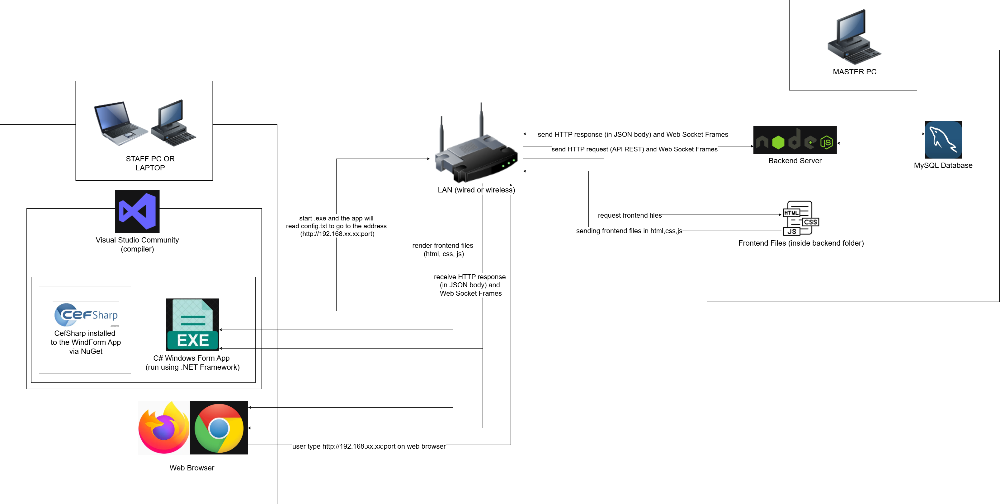

## Use-Case Diagram

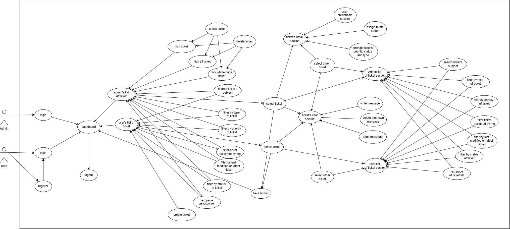

## ERD Diagram

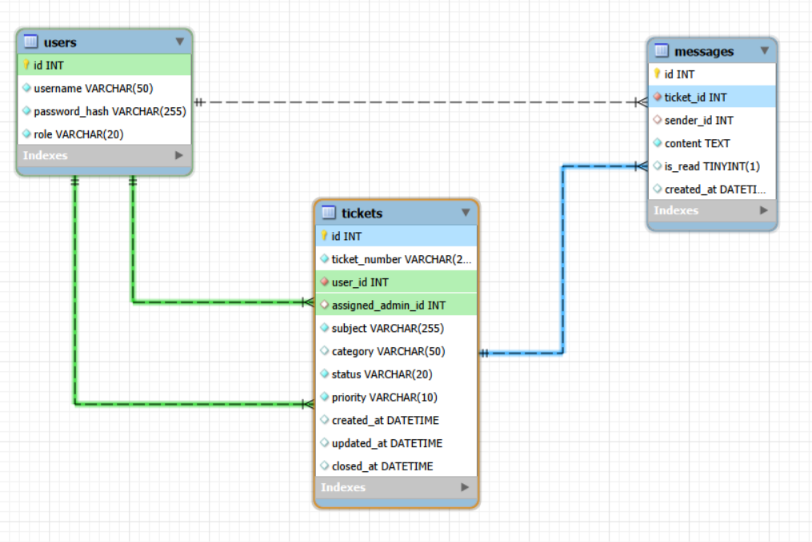

## Authentication Admin Flowchart 

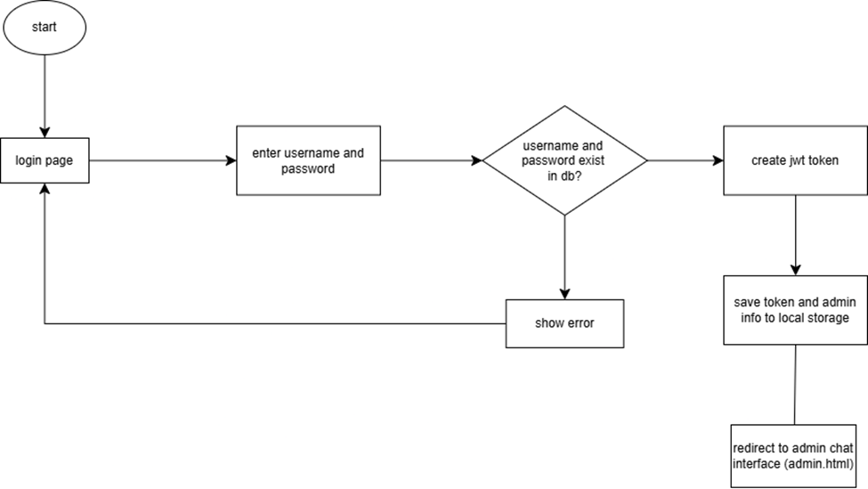

## Authentication User Flowchart

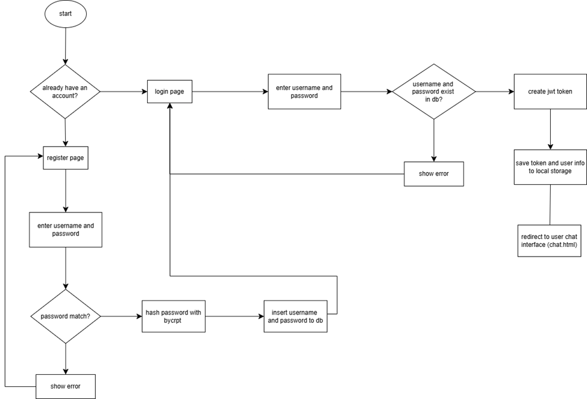

## Admin Ticket Chat Flow Flowchart


## User Ticket Chat Flow Flowchart


## UI Screenshots


### Login Screen
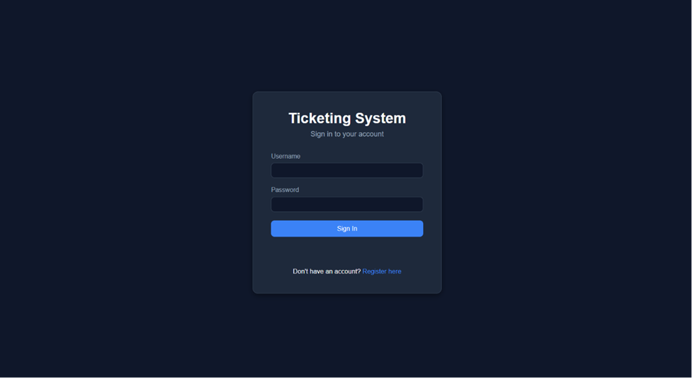

### Register Screen
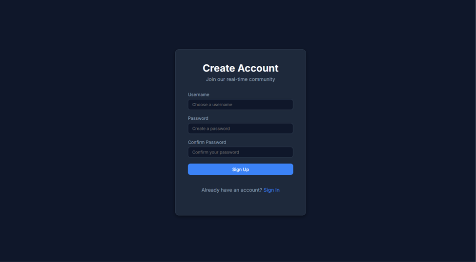

### User Ticket Dashboard
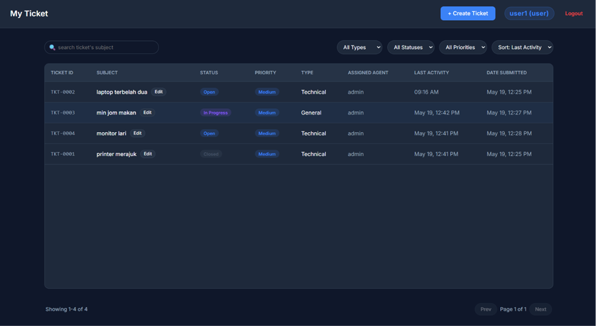

### Admin Ticket Dashboard
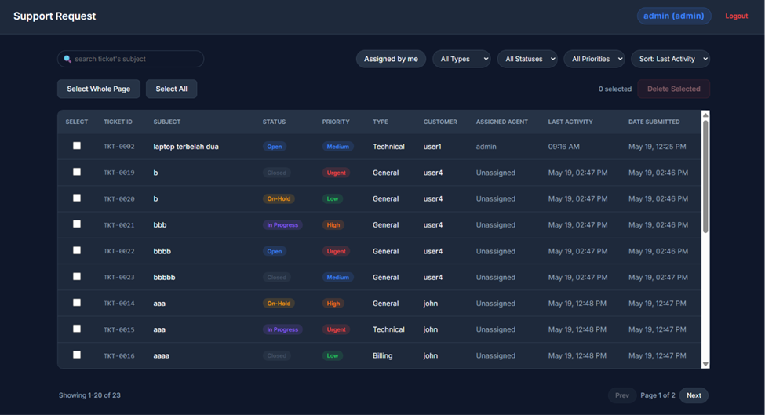

### User Ticket Workspace (Chat)
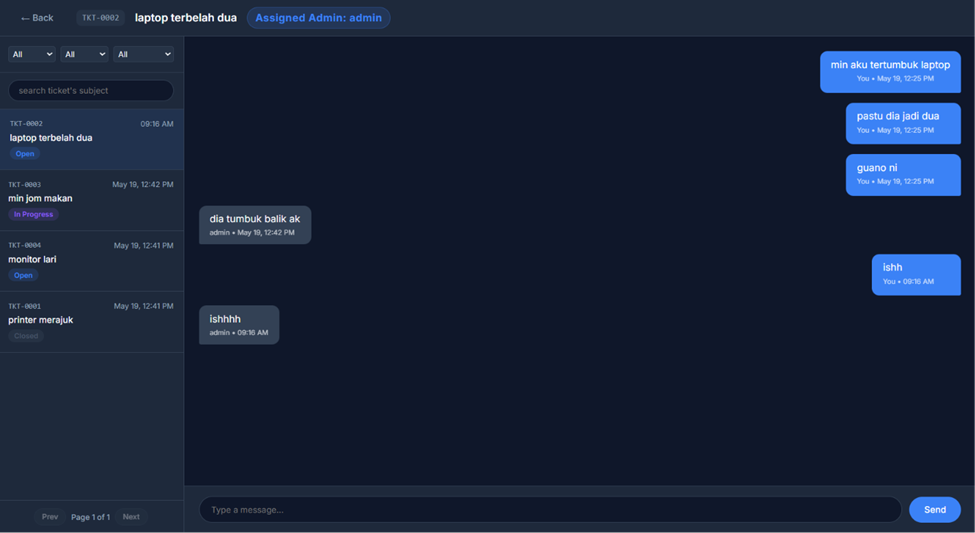

### Admin Ticket Workspace (Chat)
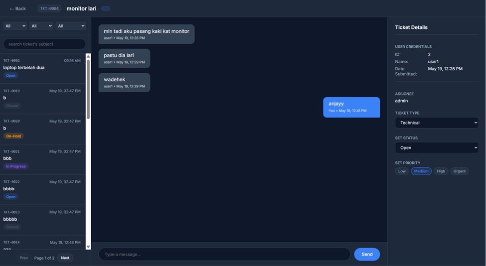

## 🎥 Demo-Youtube Link

<p align="center">
  <a href="https://youtu.be/vaC4OYSJ43U">
    
  </a>
</p>


