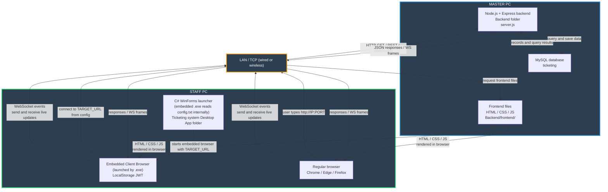
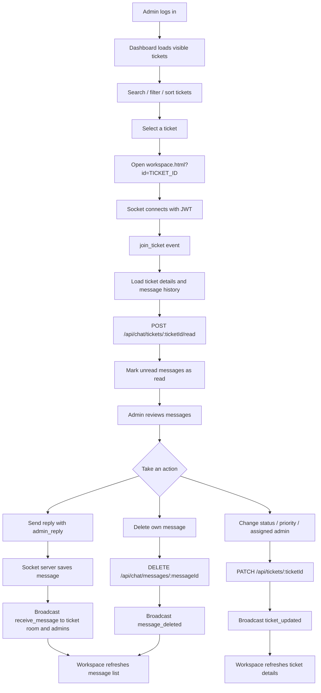
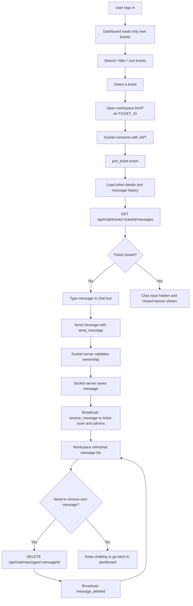

## Mermaid Architecture Diagram

### Ticket Chat Flowcharts

#### Admin Ticket Chat Flow

#### User Ticket Chat Flow

Client → Server:

HTTP requests (REST verbs: GET/POST/PATCH/DELETE) — typically include Authorization: Bearer <JWT>.
WebSocket frames/messages over the persistent socket (Socket.io emits events which are carried as WS frames when using WebSocket transport).
Server → Client:

HTTP responses (status + headers) with a JSON body for REST endpoints.
WebSocket frames/messages pushed over the socket for live updates (server can push anytime).
Notes:

WebSocket is bidirectional — either side can send frames without a prior request.
Socket.io usually uses WebSocket but may fall back to HTTP polling; its events map to messages/frames when WebSocket is used.
JWT must be verified on both HTTP routes (middleware) and on the socket handshake (e.g., io.use(...)).
GPT-5 mini • 0x